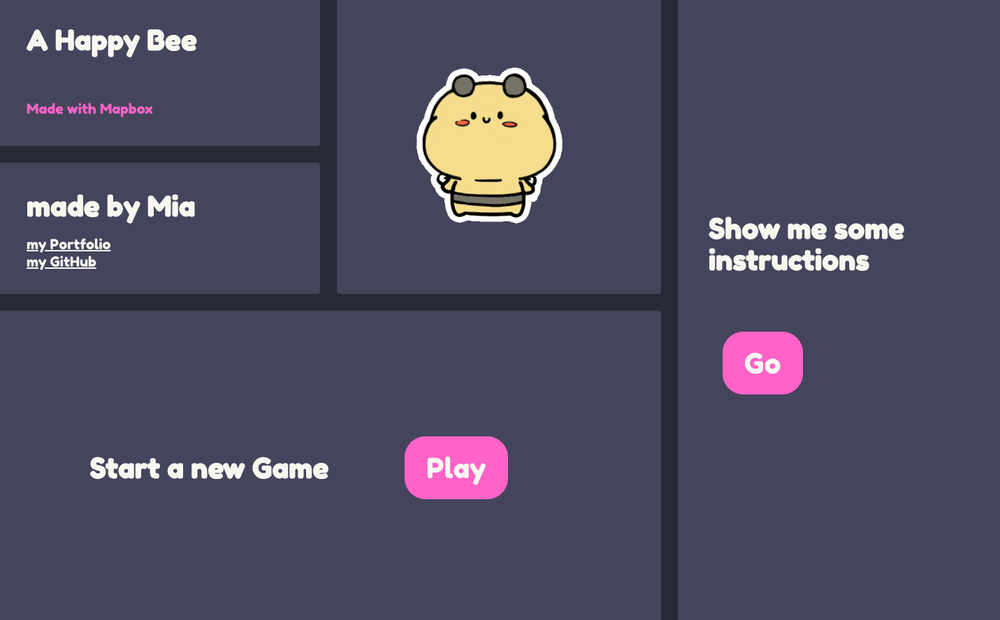
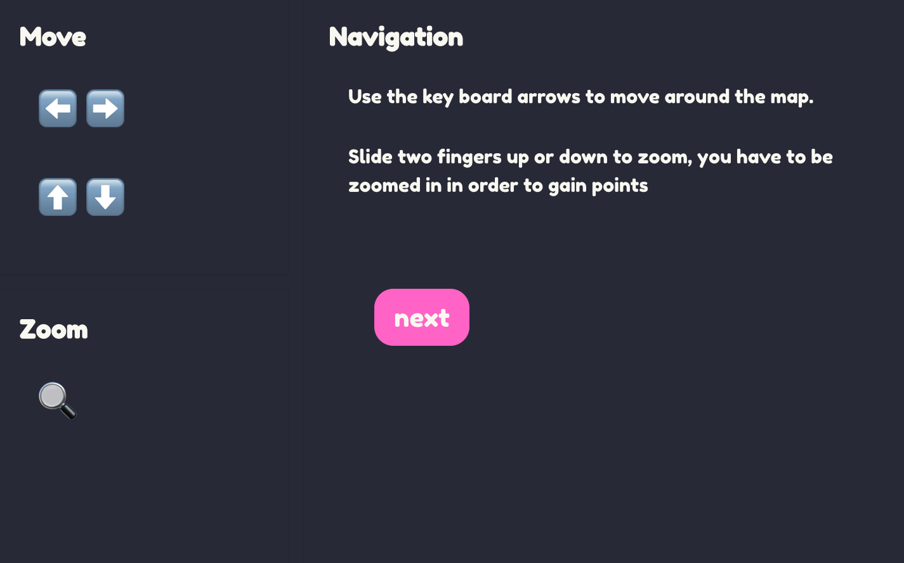
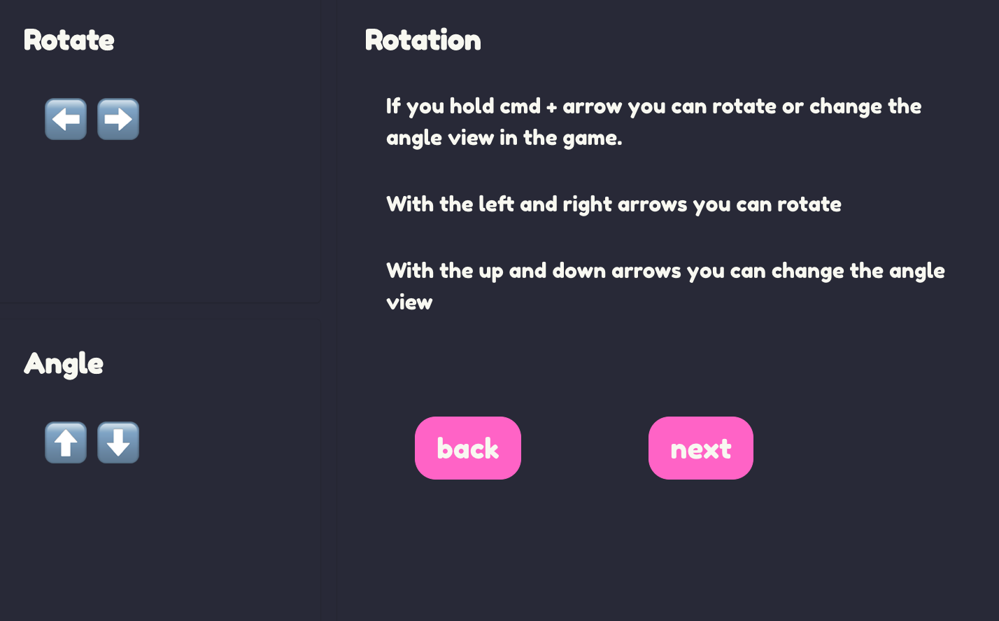
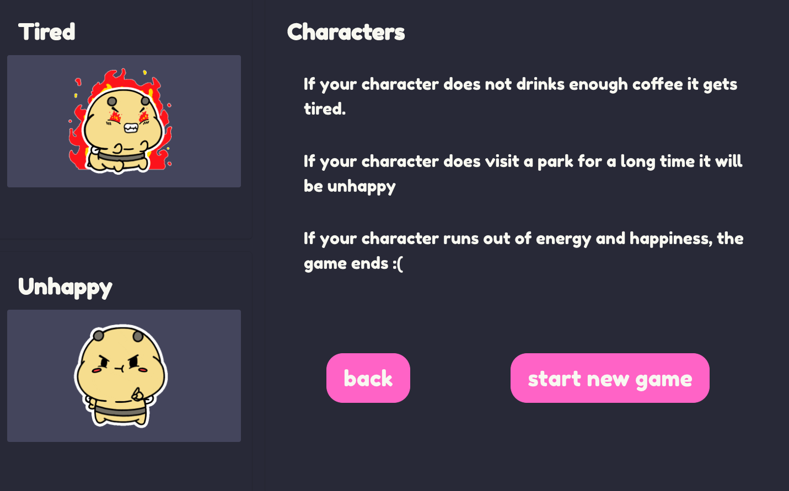
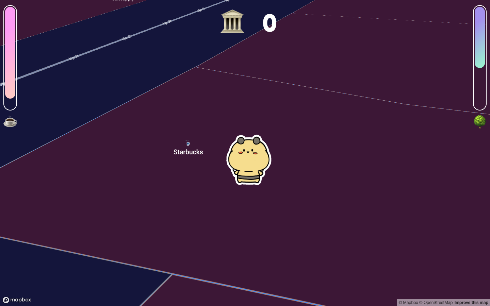
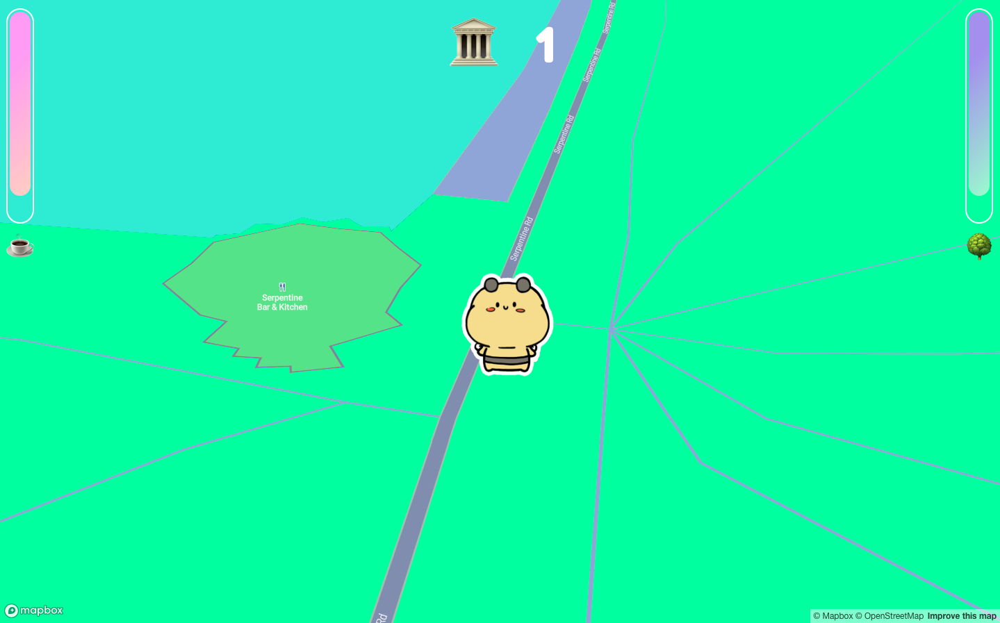

# The Happy Bee - Mapbox

This is a game built with React and it consumes the Mapbox API through the new Uber React Mapbox wrapper. The aim of the game is to walk the bee around a city, making sure you feed it enough coffee and visit parks often. If the bee is tired and sad then it's game over! 😨

## Deployment

This app is deployed in heroku, here is the link: https://happy-bee-mapbox.herokuapp.com/

## Set up

In order to run this app locally, clone it to your local machine. Once you've done that, you can run these commands: 

```
//install all the dependancies needed
npm i
//run in your localhost
npm run serve
```

## Mapbox

For this game I created my own custom mapbox style, if you want to use it here is the link: mapbox://styles/miameroi/ck1jh3yp81bj41cmj37nj7w23

## Game Experience

When the user lands on the homepage they can choose to see the instructions or start a new game:

----



----

Here are the instructions: 

----





----

In the game, there are two life bars that indicate what the bee needs. The bars increases if the bee visits a coffee shop or a park respectively:

----




----

## Game Logic & Challenges

I used mapbox tiles to check where the user is. The check is performed every 500 moves because the API has a limit to how many requests one can make per minute. 


```javascript
  getLayerData() {
    const moves = this.state.moves + 1
    this.setState({ moves })

    if (this.state.firstBarHeight > 0 && this.state.secondBarHeight > 0 && moves % 300 === 0) {
      axios.get(`https://api.mapbox.com/v4/mapbox.mapbox-streets-v8/tilequery/${this.state.viewport.longitude},${this.state.viewport.latitude}.json?radius=100&layers=poi_label&access_token=${token}`)
        .then(res => {
          const lastLayer = res.data.features[0]
          const firstBarHeight = this.state.firstBarHeight - 5
          const secondBarHeight = this.state.secondBarHeight - 5
          this.setState({ layer: lastLayer.properties.type, firstBarHeight, secondBarHeight })
        })
        .catch(() => this.setState({ layer: '' }))
    } else if (this.state.firstBarHeight === 0 && this.state.secondBarHeight === 0) {
      this.props.history.push('/end')
    }
  }
```

Using tiles was great for this project, but they were quite challenging to work with. For instance some tiles have multiple features and I choose to only ever pick the first feature in the array. However, this means that some coffee shops only show up as 'building' and they don't always add points for the user. 

## Future Improvements

In the future I'm going to add a feature which will allow the bee to be placed in the current location of the player. 


